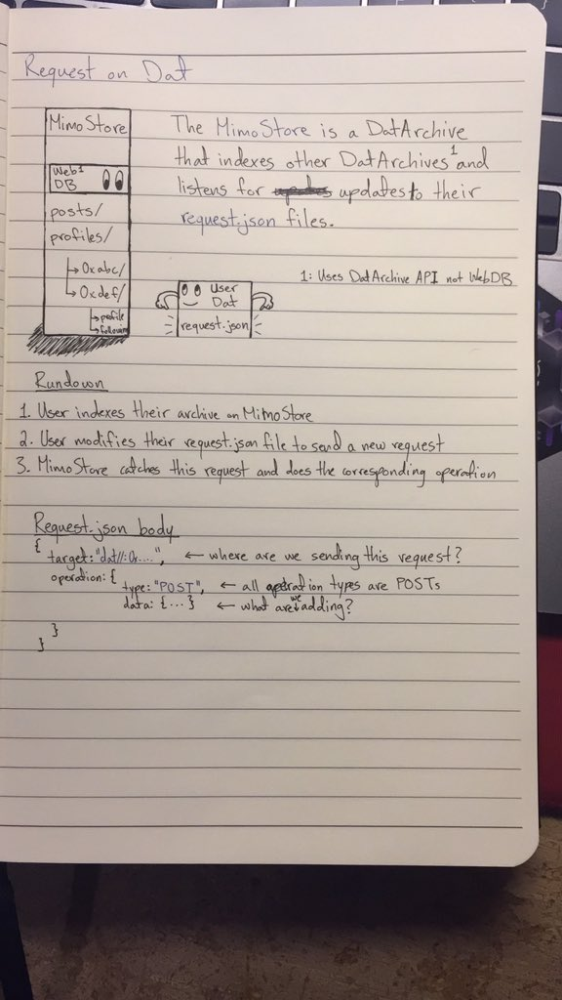

# Requests on Dat



### Problem
Since DatArchive are essentially folders on a p2p network, you can't push data to another DatArchive.

`GET`-ing is trivial enough on Dat, just fetch a file from whichever archive you want. However, `POST`-ing data to a remote archive you don't own is a lot more complicated.

### Solution
To solve this problem we take advantage of Beaker's [`DatArchive` API](https://beakerbrowser.com/docs/apis/dat) to `.watch()` remote archives for incoming requests.

Let `S` be a remote store (also a DatArchive) watching for incoming requests and `R` an archive sending requests to our store `S`. `S` watches `R` and other archives for any changes to their `request.json` files. Any change to that file can be interpreted as a new request.

##### `request.json` example
```json
{
  "target": "dat://S",
  "operations": [
    {
      "type": "update",
      "data": {
        "bio": "this my new bio"
      }
    }
  ]
}
```

`target` is the destination of our request. In our case we are sending a request to `S` so our target is `dat://S` (keep in mind `S` is a DatArchive).
`operations` are the changes we want to effectuate at our `target`. You specify the `type` of change you want to do, this can be a `create`, `update` or `delete` and the you supply the `data` for the operation.

Before sending any requests, `R` has to make `S` aware of its existence so that `S` knows to watch `R` for any changes to its `request.json` file.

Next, `R` can change their `request.json` file, `S` will catch this change (if the target is `dat://S`) and updates its files accordingly.


### Issues
- Not sufficiently trustless, owner of the store archive could delete data if they want
- Data can't be sent unsolicited, meaning unless a store is aware of any peers existence they won't be able to watch for any requests sent from that peer.
